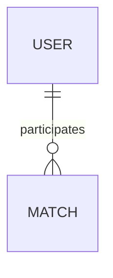

# AI Agent Conventions for Pingclub

## 🚫 General Rules
- **Do not create instruction file** after finishing a task
- **File naming**: Files in `/docs` folder should follow the same format as folder names in the app
- **Diagrams**: Use Mermaid.js syntax
- No need to write document after finishing a task.
- Language for this project is Vietnamese

## 📁 Monorepo Structure

```
pingclub/
├── apps/              # Applications
│   ├── admin-portal/  # Next.js Admin Dashboard (Port 8080)
│   ├── mobile-app/    # React Native/Expo Mobile App
│   └── api-server/    # Next.js Backend API (Port 3000)
├── packages/          # Shared packages
│   ├── database/      # @pingclub/database - Prisma client
│   ├── auth/          # @pingclub/auth - Auth utilities
│   ├── web-ui/        # @pingclub/web-ui - Web design tokens
│   └── mobile-ui/     # @pingclub/mobile-ui - Mobile design tokens
└── docs/              # Documentation
    ├── features/      # Feature capabilities
    ├── technical/     # Implementation details
    ├── architecture/  # Architecture decisions
    └── api/           # API documentation
```

## 📦 Import Conventions

### Workspace Packages
```typescript
// Import from shared packages
import { prisma, User, UserRole } from '@pingclub/database';
import { hashPassword, verifyPassword } from '@pingclub/auth';
import { verifyAdminCredentials } from '@pingclub/auth/admin';
import { COLORS, TYPOGRAPHY } from '@pingclub/web-ui/tokens';
import { COLORS as MOBILE_COLORS } from '@pingclub/mobile-ui/tokens';
```

### Local Imports
```typescript
// Use path alias for local imports
import { Component } from '@/components/Component';
import { helper } from '@/lib/helper';
import { UserService } from '@/server/modules/users/user.service';
```

## 🎨 Code Style (Prettier)

```json
{
  "semi": true,              // Always use semicolons
  "trailingComma": "all",    // Trailing commas everywhere
  "singleQuote": true,       // Use single quotes
  "printWidth": 100,         // Max 100 characters per line
  "tabWidth": 2,             // 2 spaces for indentation
  "arrowParens": "always"    // Always wrap arrow function params
}
```

**Examples:**
```typescript
// ✅ GOOD
const user = await prisma.user.findUnique({
  where: { id: userId },
  include: { devices: true, loginHistory: true },
});

// ❌ BAD
const user = await prisma.user.findUnique({
  where: {id: userId},
  include: {devices: true, loginHistory: true}
})
```

## 🏷️ Naming Conventions

### Files & Folders
- **Components**: `kebab-case.tsx` (e.g., `user-table.tsx`, `login-form.tsx`)
- **Utilities**: `camelCase.ts` (e.g., `apiClient.ts`, `dateUtils.ts`)
- **API Routes**: `route.ts` (Next.js App Router convention)
- **Modules**: `kebab-case/` folders (e.g., `user-management/`, `auth-flow/`)

### Code
- **Variables/Functions**: `camelCase` (e.g., `getUserById`, `isAuthenticated`)
- **Components**: `PascalCase` (e.g., `UserTable`, `LoginForm`)
- **Types/Interfaces**: `PascalCase` (e.g., `User`, `AuthResponse`)
- **Constants**: `UPPER_SNAKE_CASE` (e.g., `MAX_LOGIN_ATTEMPTS`, `TOKEN_EXPIRY`)
- **Enums**: `PascalCase` (e.g., `UserRole`, `UserStatus`)

### Database (Prisma)
- **Models**: `PascalCase` (e.g., `User`, `Match`, `LoginHistory`)
- **Fields in DB**: `snake_case` with `@map()` (e.g., `@map("first_name")`)
- **Fields in TypeScript**: `camelCase` (e.g., `firstName`, `createdAt`)

**Example:**
```prisma
model User {
  firstName String? @map("first_name")
  lastName  String? @map("last_name")
  createdAt DateTime @default(now()) @map("created_at")
}
```

## 🔧 TypeScript Configuration

### Compiler Options (All Apps)
```json
{
  "strict": true,                    // Always use strict mode
  "noEmit": true,                    // Next.js handles compilation
  "esModuleInterop": true,
  "moduleResolution": "bundler",
  "resolveJsonModule": true,
  "isolatedModules": true,
  "jsx": "preserve",
  "skipLibCheck": true
}
```

### Path Aliases
```json
{
  "paths": {
    "@/*": ["./src/*"],
    "@/server/*": ["./src/server/*"],
    "@/shared/*": ["./src/shared/*"],
    "@pingclub/database": ["../../packages/database/src/index.ts"],
    "@pingclub/auth": ["../../packages/auth/src/index.ts"]
  }
}
```

## 📝 Development Workflow

### Scripts
```bash
# Development
yarn dev              # Start all apps
yarn dev:admin        # Start admin-portal only
yarn dev:mobile       # Start mobile-app only
yarn dev:api          # Start api-server only

# Build
yarn build            # Build all apps
yarn build:admin      # Build admin-portal
yarn build:api        # Build api-server

# Database
yarn db:generate      # Generate Prisma client (ALWAYS run after schema changes)
yarn db:migrate       # Create and run migrations
yarn db:studio        # Open Prisma Studio
yarn db:seed          # Seed database

# Quality
yarn lint             # Lint all packages
yarn type-check       # Type check all packages
```

### Development Order
1. **Database Changes**: Update `packages/database/prisma/schema.prisma`
2. **Generate Prisma**: Run `yarn db:generate`
3. **Migration**: Run `yarn db:migrate dev --name description`
4. **Implement**: Write code using generated types
5. **Test**: Test in respective app. Use playwright mcp to test
6. **Detect and fix bugs**: Use playwright mcp to reproduce the issue to find to root cause. 

## 🏗️ Code Organization Principles

### ✅ DO's
- **Single Responsibility**: Each package/module has ONE clear purpose
- **Shared Code**: Use workspace packages (`@pingclub/*`) for shared logic
- **Type Safety**: Use TypeScript strict mode, leverage Prisma types
- **Build Order**: Always build packages before apps
- **Dependency Flow**: Apps → Packages (never reverse)
- **Path Aliases**: Use `@/*` for local imports, never relative paths like `../../../`

### ❌ DON'Ts
- **No Circular Dependencies**: Never create circular imports
- **No Code Duplication**: Extract shared code to packages
- **No Mixed Concerns**: Don't mix app and package code
- **No Publishing**: Internal packages are NOT published to npm
- **No Type Skipping**: Never use `any` without good reason
- **No Build Errors**: Fix all TypeScript/ESLint errors before committing

## 📊 Database Patterns

### Query Patterns
```typescript
// ✅ GOOD - Use Prisma generated types
import { prisma, User, Prisma } from '@pingclub/database';

const user = await prisma.user.findUnique({
  where: { id: userId },
  select: {
    id: true,
    email: true,
    firstName: true,
    lastName: true,
  },
});

// ✅ GOOD - Use type-safe where clause
const whereClause: Prisma.UserWhereInput = {
  status: 'ACTIVE',
  role: { in: ['USER', 'ADMIN'] },
};

// ❌ BAD - Don't use raw SQL unless absolutely necessary
```

### Index Guidelines
- Add indexes on frequently queried fields (email, firebaseUid, status)
- Add indexes on foreign keys
- Add composite indexes for common query combinations

## 🎯 Feature Implementation Pattern

### 1. Database Schema (if needed)
```prisma
// packages/database/prisma/schema.prisma
model Member {
  id          String   @id @default(cuid())
  name        String
  email       String?
  status      MemberStatus @default(ACTIVE)
  createdAt   DateTime @default(now()) @map("created_at")

  @@index([status])
  @@map("members")
}
```

### 2. API Route (api-server)
```typescript
// apps/api-server/src/app/api/admin/members/route.ts
import { prisma } from '@pingclub/database';
import { NextResponse } from 'next/server';

export async function GET() {
  const members = await prisma.user.findMany({
    where: { status: 'ACTIVE' },
    orderBy: { createdAt: 'desc' },
  });

  return NextResponse.json(members);
}
```

### 3. Frontend Component (admin-portal)
- Follow Mobile First
- Add component from shadcn and build on top of it
```typescript
// apps/admin-portal/src/app/members/page.tsx
'use client';

import { useEffect, useState } from 'react';
import type { User } from '@pingclub/database';

export default function MembersPage() {
  const [members, setMembers] = useState<User[]>([]);

  useEffect(() => {
    fetch('/api/admin/members')
      .then((res) => res.json())
      .then(setMembers);
  }, []);

  return <div>{/* UI */}</div>;
}
```

### 4. Documentation
```markdown
<!-- docs/features/member-management.md -->
# Member Management

## Features
- Create and manage members
- Track player ratings and matches
- View member profiles

## API Endpoints
- `GET /api/admin/members` - List members
- `POST /api/admin/members` - Create member
```

## 🔐 Security Best Practices

- **Password Hashing**: Always use `@pingclub/auth/utils` - never implement your own
- **Token Validation**: Use JWT validation utilities from `@pingclub/auth`
- **SQL Injection**: Use Prisma (already protected)
- **XSS Protection**: Sanitize user inputs in forms
- **Authentication**: Check user roles before allowing operations

## 📚 Documentation Requirements

### When to Update Docs
- New features added → Update `docs/features/`
- Architecture changes → Update `docs/architecture/`
- API changes → Update `docs/api/`
- Database schema changes → Update `docs/technical/database-schema.md`

### Documentation Format
```markdown
# Feature Name

## Overview
Brief description

## Technical Implementation
Implementation details with code examples

## API Endpoints
List of endpoints with request/response examples

## Database Schema

```

## 🚀 Deployment Notes

- **Admin Portal**: Port 8080, Next.js SSR
- **API Server**: Port 3000, Next.js API Routes
- **Mobile App**: Expo/React Native
- **Database**: PostgreSQL with Prisma
- **Package Manager**: Yarn 1.22.22
- **Build Tool**: Turborepo 2.0

---

**Last Updated**: January 2026
**For AI Agents**: Follow these conventions for consistent code generation